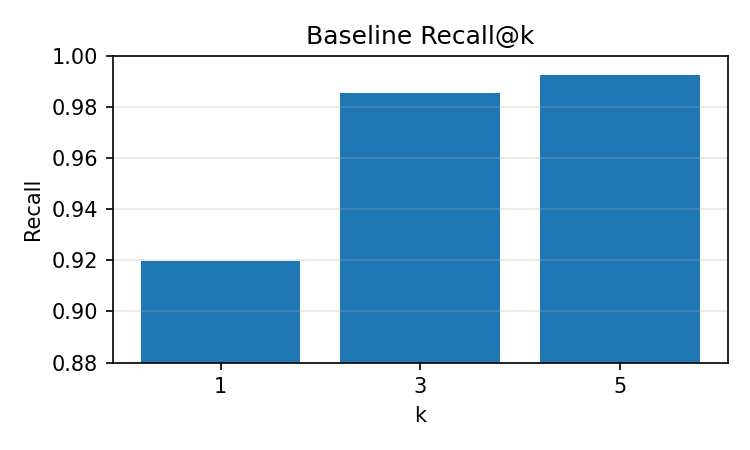
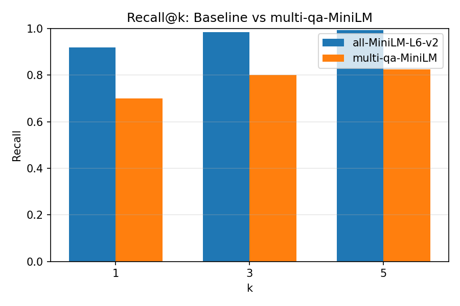
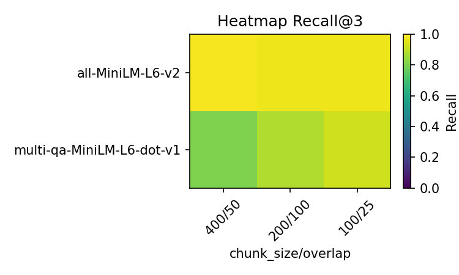

# Generative Benchmarking for RAG Systems

This project implements a generative benchmarking system to evaluate and optimize Retrieval-Augmented Generation (RAG) pipelines. Rather than relying on subjective "vibes-based" assessments, we create synthetic test sets from our own documents to systematically measure retrieval performance and make data-driven improvements.

## Project Overview

Evaluating RAG systems presents unique challenges because their outputs are generative and nuanced. Standard benchmarks often don't reflect the specific domains or characteristics of our actual data. Generative benchmarking solves this by automatically creating evaluation datasets from our own documents, allowing us to build customized and relevant evaluation frameworks.

The core workflow follows these steps:
1. Ingest and process documents from a chosen dataset
2. Generate synthetic queries that each document chunk could answer
3. Evaluate retrieval performance using recall@k metrics
4. Systematically test different components (embedding models, chunking strategies)
5. Measure and visualize the impact of each change

## Dataset and Methodology

### Dataset Choice: AG News

We selected the AG News corpus for this benchmark, specifically sampling 500 articles from the training set. This dataset provides several advantages:

- **Clean, structured content**: Each article is a self-contained news snippet with distinct topics
- **Appropriate length**: Articles are neither too short nor too long for effective chunking
- **Diverse topics**: Covers business, technology, sports, and world news
- **Consistent quality**: Professional journalism provides clear, well-written text

Token analysis revealed articles averaging 61.7 tokens with a range of 13-142 tokens, making them ideal for our chunking experiments.

### Synthetic Query Generation

We used Google's FLAN-T5-small model to generate questions from document chunks. This approach offers:

- **Speed**: Local execution with batches of 16 enables rapid generation
- **Cost efficiency**: No API costs compared to larger models
- **Consistency**: Deterministic results for reproducible benchmarks

The prompt template `"generate question: "{passage}""` produced 549 synthetic queries, one per chunk. This creates our golden test set of (query, relevant_document_id) pairs.

### Evaluation Metric: Recall@k

Recall@k measures how often the correct document appears in the top k retrieved results. For a perfect retrieval system, recall@5 would be 1.0 (100%), meaning every query finds its source document in the top 5 results.

We evaluate at k=1, 3, and 5 to understand both precision (k=1) and the system's ability to capture relevant documents with more relaxed constraints.

## Baseline Results

Our baseline system uses `all-MiniLM-L6-v2` embeddings with 400-token chunks and 50-token overlap.

### Initial Performance



| k | Recall |
|---|--------|
| 1 | 0.920  |
| 3 | 0.985  |
| 5 | 0.993  |

These strong baseline results reflect the high quality of our synthetic queries and the effectiveness of the chunking strategy. The minimal gap between recall@3 and recall@5 suggests most relevant documents are captured within the top 3 results.

## Component Analysis: Embedding Model Comparison

We tested the impact of switching from a general-purpose embedding model to one specifically fine-tuned for question-answering tasks.

### Embedding Model Swap

**Baseline**: `all-MiniLM-L6-v2` (general similarity model)  
**Alternative**: `multi-qa-MiniLM-L6-dot-v1` (QA-optimized model)



| k | all-MiniLM-L6-v2 | multi-qa-MiniLM |
|---|------------------|-----------------|
| 1 | 0.920           | 0.699           |
| 3 | 0.985           | 0.801           |
| 5 | 0.993           | 0.825           |

### Unexpected Results and Analysis

Counter to expectations, the QA-optimized model performed significantly worse. Several factors likely contribute to this:

1. **Training domain mismatch**: The QA model may have been trained on different question formats than our FLAN-T5 generated queries
2. **Vector space optimization**: The general similarity model's broader training may better capture the semantic relationship between our synthetic questions and news content
3. **Embedding dimensionality effects**: Different internal representations may affect retrieval in our specific use case

This demonstrates the value of empirical testing rather than relying on model names or descriptions.

## Matrix Benchmark: Comprehensive Component Testing

To understand the interaction between embedding models and chunking strategies, we conducted a full matrix evaluation.

### Experimental Design

**Embedding Models**:
- `all-MiniLM-L6-v2` (general purpose)
- `multi-qa-MiniLM-L6-dot-v1` (QA-optimized)

**Chunking Configurations**:
- 400/50 (chunk_size/overlap) - our baseline
- 200/100 - smaller chunks with higher overlap
- 100/25 - very small chunks with minimal overlap

### Matrix Results

| Model | Chunk Config | Recall@1 | Recall@3 | Recall@5 |
|-------|--------------|----------|----------|----------|
| **all-MiniLM-L6-v2** | 400/50 | 0.920 | 0.985 | 0.993 |
| **all-MiniLM-L6-v2** | 200/100 | 0.922 | 0.976 | 0.991 |
| **all-MiniLM-L6-v2** | 100/25 | 0.916 | 0.974 | 0.982 |
| **multi-qa-MiniLM** | 400/50 | 0.701 | 0.805 | 0.829 |
| **multi-qa-MiniLM** | 200/100 | 0.820 | 0.882 | 0.894 |
| **multi-qa-MiniLM** | 100/25 | 0.869 | 0.929 | 0.938 |

### Visualization: Recall@3 Analysis




### Key Insights

**Embedding-Chunk Interaction**: The two models respond differently to chunking strategies:

- **all-MiniLM-L6-v2**: Performs consistently across chunk sizes, with slight preference for medium chunks (400/50)
- **multi-qa-MiniLM**: Shows clear improvement with smaller chunks, suggesting its QA training benefits from more focused content

**Practical Implications**:
1. **Storage vs Performance Trade-off**: Smaller chunks mean more vectors to store and search, increasing computational costs
2. **Model-Specific Optimization**: The best chunking strategy depends heavily on your chosen embedding model
3. **Context Preservation**: Very small chunks (100/25) may lose important context despite improving recall for some models

## Technical Implementation

### Architecture

The system consists of three main components:

1. **Document Processing** (`src/chunker.py`): Handles text splitting using LangChain's RecursiveCharacterTextSplitter
2. **Indexing** (`src/indexer.py`): Manages embedding generation and Chroma vector database operations  
3. **Evaluation Pipeline** (`01_end_to_end.ipynb`): Orchestrates the full benchmark workflow

### Key Dependencies

- **LangChain**: Document processing and retrieval abstractions
- **Chroma**: Vector database for embedding storage and similarity search
- **Sentence-Transformers**: Embedding model implementations
- **FLAN-T5**: Synthetic query generation
- **Matplotlib**: Results visualization

## Reproduction Instructions

### Setup Environment

```bash
git clone <your-repository-url>
cd generative-benchmark

# Create conda environment
conda env create -f environment.yml
conda activate genbench
```

### Run the Complete Pipeline

```bash
# Launch Jupyter Lab
jupyter lab

# Open and run 01_end_to_end.ipynb
# Execute all cells in order - the notebook is designed to run end-to-end
```

### Cached Data

To speed up reproduction:
- `data/processed/docs.parquet`: Preprocessed AG News articles (committed to repo)
- `data/queries.jsonl`: Generated synthetic queries (committed to repo)

The notebook will detect cached files and skip regeneration steps automatically.

### Expected Runtime

- **First run**: ~10-15 (includes query generation)
- **Subsequent runs**: ~2-3 minutes (uses cached queries)
- **Matrix benchmark**: Additional ~2 minutes

## Key Findings and Recommendations

### Primary Insights

1. **Model Selection Matters More Than Expected**: The choice of embedding model had a dramatic impact, with our "general purpose" model significantly outperforming the "QA-optimized" alternative
2. **Chunking Strategy is Model-Dependent**: Optimal chunk sizes vary by embedding model, emphasizing the need for systematic testing
3. **Diminishing Returns**: The difference between recall@3 and recall@5 is minimal, suggesting k=3 provides most of the benefit

### Practical Applications

For production RAG systems:
- **Always benchmark empirically** rather than relying on model marketing claims
- **Test multiple configurations** even when one seems obviously better
- **Consider computational costs** when choosing between chunk sizes
- **Use generative benchmarking** to validate improvements on your specific use case

### Future Extensions

This framework could be extended with:
- **Reranking models** for improved precision
- **Different similarity metrics** beyond cosine similarity  
- **Question type analysis** to understand what types of queries perform better
- **Larger scale testing** with more diverse document types

## Conclusion

This project demonstrates the power of generative benchmarking for making data-driven decisions about RAG pipeline components. By creating synthetic test sets from our own data, we uncovered surprising results that challenge conventional assumptions about "better" models.

The methodology provides a reproducible framework for evaluating any RAG system component, enabling confident optimization decisions based on quantitative metrics rather than intuition. Most importantly, it revealed that the interaction between different components (embedding models and chunking strategies) creates complex performance characteristics that require systematic measurement to understand.

The complete codebase, results, and visualizations provide a template for applying similar benchmarking approaches to other domains and datasets.