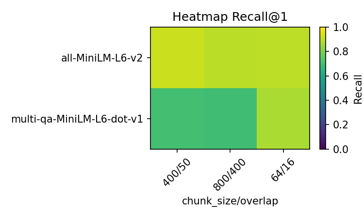
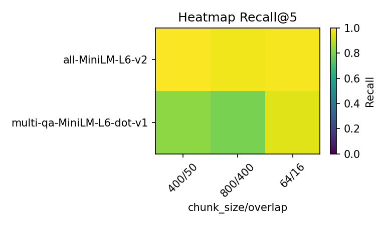

# Generative Benchmarking for RAG Systems

This project implements a generative benchmarking system to evaluate and optimize Retrieval-Augmented Generation (RAG) pipelines. Rather than relying on subjective "vibes-based" assessments, we create synthetic test sets from our own documents to systematically measure retrieval performance and make data-driven improvements.

## Project Overview

Evaluating RAG systems presents unique challenges because their outputs are generative and nuanced. Standard benchmarks often don't reflect the specific domains or characteristics of our actual data. Generative benchmarking solves this by automatically creating evaluation datasets from our own documents, allowing us to build customized and relevant evaluation frameworks.

The core workflow follows these steps:
1. Ingest and process documents from a chosen dataset
2. Generate synthetic queries that each document chunk could answer
3. Evaluate retrieval performance using recall@k metrics
4. Systematically test different components (embedding models, chunking strategies)
5. Measure and visualize the impact of each change

## Dataset and Methodology

### Dataset Choice: AG News

We selected the AG News corpus for this benchmark, specifically sampling 500 articles from the training set. This dataset provides several advantages:

- **Clean, structured content**: Each article is a self-contained news snippet with distinct topics
- **Appropriate length**: Articles are neither too short nor too long for effective chunking
- **Diverse topics**: Covers business, technology, sports, and world news
- **Consistent quality**: Professional journalism provides clear, well-written text

Token analysis revealed articles averaging 61.7 tokens with a range of 13-142 tokens, making them ideal for our chunking experiments.

### Synthetic Query Generation

We used Google's FLAN-T5-small model to generate questions from document chunks. This approach offers:

- **Speed**: Local execution with batches of 16 enables rapid generation
- **Cost efficiency**: No API costs compared to larger models
- **Consistency**: Deterministic results for reproducible benchmarks

The prompt template `"generate question: "{passage}""` produced 549 synthetic queries, one per chunk. This creates our golden test set of (query, relevant_document_id) pairs.

### Evaluation Metric: Recall@k

Recall@k measures how often the correct document appears in the top k retrieved results. For a perfect retrieval system, recall@5 would be 1.0 (100%), meaning every query finds its source document in the top 5 results.

We evaluate at k=1, 3, and 5 to understand both precision (k=1) and the system's ability to capture relevant documents with more relaxed constraints.

## Baseline Results

Our baseline system uses `all-MiniLM-L6-v2` embeddings with 400-token chunks and 50-token overlap.

### Initial Performance


The zoomed view above highlights the excellent baseline performance. The y-axis is scaled to the 0.88-1.0 range to better show the differences between recall levels.

| k | Recall |
|---|--------|
| 1 | 0.920  |
| 3 | 0.985  |
| 5 | 0.993  |

These strong baseline results reflect the high quality of our synthetic queries and the effectiveness of the chunking strategy. The minimal gap between recall@3 and recall@5 suggests most relevant documents are captured within the top 3 results.

## Component Analysis: Embedding Model Comparison

We tested the impact of switching from a general-purpose embedding model to one specifically fine-tuned for question-answering tasks.

### Embedding Model Swap

**Baseline**: `all-MiniLM-L6-v2` (general similarity model)  
**Alternative**: `multi-qa-MiniLM-L6-dot-v1` (QA-optimized model)


The side-by-side comparison reveals a surprising result: the general-purpose model significantly outperforms the QA-specialized model across all k values.

| k | all-MiniLM-L6-v2 | multi-qa-MiniLM |
|---|------------------|-----------------|
| 1 | 0.920           | 0.699           |
| 3 | 0.985           | 0.801           |
| 5 | 0.993           | 0.825           |

### Unexpected Results and Analysis

Counter to expectations, the QA-optimized model performed significantly worse. Several factors likely contribute to this:

1. **Training domain mismatch**: The QA model may have been trained on different question formats than our FLAN-T5 generated queries
2. **Vector space optimization**: The general similarity model's broader training may better capture the semantic relationship between our synthetic questions and news content
3. **Embedding dimensionality effects**: Different internal representations may affect retrieval in our specific use case

This demonstrates the value of empirical testing rather than relying on model names or descriptions.

## Comprehensive Matrix Benchmark

To understand the interaction between embedding models and chunking strategies, we conducted a full matrix evaluation across all combinations.

### Experimental Design

**Embedding Models**:
- `all-MiniLM-L6-v2` (general purpose)
- `multi-qa-MiniLM-L6-dot-v1` (QA-optimized)

**Chunking Configurations**:
- **400/50** (chunk_size/overlap) → **549 chunks** - our baseline
- **800/400** (larger chunks, high overlap) → **501 chunks** - fewer, larger chunks
- **64/16** (very small chunks, minimal overlap) → **2773 chunks** - many small chunks

### Complete Results Matrix

| Model | Chunk Config | Chunks | Recall@1 | Recall@3 | Recall@5 |
|-------|--------------|--------|----------|----------|----------|
| **all-MiniLM-L6-v2** | 400/50 | 549 | 0.920 | 0.985 | 0.993 |
| **all-MiniLM-L6-v2** | 800/400 | 501 | 0.898 | 0.973 | 0.978 |
| **all-MiniLM-L6-v2** | 64/16 | 2773 | 0.902 | 0.978 | 0.985 |
| **multi-qa-MiniLM** | 400/50 | 549 | 0.703 | 0.807 | 0.831 |
| **multi-qa-MiniLM** | 800/400 | 501 | 0.694 | 0.780 | 0.798 |
| **multi-qa-MiniLM** | 64/16 | 2773 | 0.874 | 0.940 | 0.953 |

## Detailed Analysis by Recall Level

### Recall@1 Performance




At k=1, we're measuring precision: how often the exact correct document is the top result. The patterns reveal fundamentally different chunking preferences:

**all-MiniLM-L6-v2** shows a clear optimum at 400/50 chunks, with performance degrading in both directions:
- **800/400**: 0.920 → 0.898 (-2.2 percentage points)
- **64/16**: 0.920 → 0.902 (-1.8 percentage points)

**multi-qa-MiniLM** shows the opposite behavior, strongly preferring smaller chunks:
- **800/400**: 0.703 → 0.694 (-0.9 percentage points) 
- **64/16**: 0.703 → 0.874 (+17.1 percentage points!)

### Recall@3 Performance


At k=3, the patterns persist but become less dramatic. The QA model's improvement with smaller chunks remains substantial:

**all-MiniLM-L6-v2** maintains its preference for the medium chunk size:
- Best: 400/50 (0.985)
- Worst: 800/400 (0.973)

**multi-qa-MiniLM** continues improving with smaller chunks:
- 800/400: 0.780
- 400/50: 0.807 
- 64/16: 0.940 (best performance)

### Recall@5 Performance




At k=5, the most forgiving metric, both models show their characteristic patterns but with reduced magnitude. Even here, chunking strategy significantly impacts the QA model performance.

## Deep Analysis: Why Chunking Strategies Affect Models Differently

### The "Sweet Spot" Phenomenon for all-MiniLM-L6-v2

The general-purpose model exhibits a clear performance peak at 400/50 chunks, suggesting this configuration hits an optimal balance:

**Why 400/50 works best:**
1. **Context preservation**: 400 tokens provide sufficient context for the model to understand semantic meaning
2. **Specificity balance**: Not so large that chunks become unfocused, not so small that they lose coherence
3. **Training alignment**: The model was likely trained on text segments of similar length during its development

**Why larger chunks (800/400) hurt performance:**
- **Diluted relevance**: Larger chunks may contain multiple topics, making it harder to match specific queries
- **Noise introduction**: More text means more potential for irrelevant content to interfere with similarity matching
- **Vector representation challenges**: Longer text may result in less precise embeddings

**Why smaller chunks (64/16) also hurt performance:**
- **Context loss**: Very small chunks lose critical context that helps with semantic understanding
- **Fragmentation**: Important concepts may be split across multiple chunks
- **Increased noise**: With 2773 chunks vs 549, there's more potential for false positive matches

### The Scale-Sensitive QA Model: multi-qa-MiniLM-L6-dot-v1

The QA-optimized model shows dramatically different behavior, with a strong preference for smaller, more focused chunks:

**Why 64/16 works much better (+17.1% recall@1):**
1. **Question-answer training bias**: QA models are typically trained on focused question-answer pairs with specific, targeted content
2. **Precision over context**: The model prioritizes exact matches over broad semantic understanding
3. **Reduced interference**: Smaller chunks eliminate extraneous information that might confuse QA-specific embeddings

**Why this model struggles with larger chunks:**
- **Training mismatch**: QA datasets typically don't include long, multi-topic passages
- **Focus dilution**: The model's specialization works against it when chunks contain multiple concepts
- **Dot product optimization**: The model uses dot product similarity, which may be more sensitive to content focus

### Computational Trade-offs and Production Implications

The results reveal important production considerations:

**Storage and Search Overhead:**
- 64/16 chunks: **2773 vectors** (5x more storage and search time)
- 400/50 chunks: **549 vectors** (baseline)
- 800/400 chunks: **501 vectors** (minimal savings)

**Performance vs Cost Analysis:**
- **all-MiniLM-L6-v2**: Best performance with moderate computational cost (549 chunks)
- **multi-qa-MiniLM**: Best performance requires 5x computational overhead (2773 chunks)

**Real-world implications:**
- For the general model, the optimal configuration is also the most cost-effective
- For the QA model, achieving good performance requires significant infrastructure investment
- The choice between models should factor in both accuracy and operational costs

## Technical Implementation

### Architecture

The system consists of three main components:

1. **Document Processing** (`src/chunker.py`): Handles text splitting using LangChain's RecursiveCharacterTextSplitter
2. **Indexing** (`src/indexer.py`): Manages embedding generation and Chroma vector database operations
3. **Evaluation Pipeline** (`01_end_to_end.ipynb`): Orchestrates the full benchmark workflow

### Key Dependencies

- **LangChain**: Document processing and retrieval abstractions
- **Chroma**: Vector database for embedding storage and similarity search
- **Sentence-Transformers**: Embedding model implementations
- **FLAN-T5**: Synthetic query generation
- **Matplotlib**: Results visualization

## Reproduction Instructions

### Setup Environment

```bash
git clone https://github.com/turhanardil/mini-rag-genbench.git #https
cd generative-benchmark

# Create conda environment
conda env create -f environment.yml
conda activate genbench
```

### Run the Complete Pipeline

```bash
# Launch Jupyter Lab
jupyter lab

# Open and run 01_end_to_end.ipynb
# Execute all cells in order - the notebook is designed to run end-to-end
```

### Cached Data

To speed up reproduction:
- `data/processed/docs.parquet`: Preprocessed AG News articles (committed to repo)
- `data/queries.jsonl`: Generated synthetic queries (committed to repo)

The notebook will detect cached files and skip regeneration steps automatically.

### Expected Runtime

- **First run**: ~15-20 minutes (includes query generation)
- **Subsequent runs**: ~5-10 minutes (uses cached queries)
- **Matrix benchmark**: Additional ~15 minutes (due to 2773 chunk configuration)

## Key Findings and Strategic Insights

### Primary Discoveries

1. **Embedding Models Have Distinct Chunking Preferences**: The choice of embedding model fundamentally determines the optimal chunking strategy. This interaction effect is stronger than either component's individual impact.

2. **"General Purpose" Can Outperform "Specialized"**: Despite being designed for QA tasks, the specialized model performed significantly worse at our news article retrieval task, highlighting the importance of domain and task alignment over marketing claims.

3. **Sweet Spot vs Scale Sensitivity**: Different models exhibit fundamentally different relationships with chunk size:
   - **all-MiniLM-L6-v2**: Has a clear optimum (sweet spot behavior)
   - **multi-qa-MiniLM**: Shows monotonic improvement with smaller chunks (scale sensitive behavior)

4. **Computational Costs Scale Non-linearly**: The QA model's best performance requires 5x more vectors, dramatically increasing storage and search costs.

### Production Decision Framework

Based on these findings, production RAG systems should consider:

**For Budget-Conscious Deployments:**
- Use all-MiniLM-L6-v2 with 400/50 chunking
- Achieves 92% recall@1 with moderate computational overhead
- Provides excellent cost-performance ratio

**For Performance-Critical Applications:**
- Consider the computational trade-offs carefully
- multi-qa-MiniLM with 64/16 chunking reaches 87.4% recall@1 but at 5x the infrastructure cost
- Still underperforms the general model despite optimization efforts

**For Systematic Optimization:**
- Always test component interactions, not just individual components
- Budget for comprehensive benchmarking before production deployment
- Consider operational costs alongside accuracy metrics

### Methodology Validation and Broader Implications

This project successfully demonstrates several critical principles:

1. **Empirical Testing Beats Intuition**: The "obvious" choice (QA-optimized model) performed worse, validating the need for systematic evaluation

2. **Component Interactions Matter**: The embedding model choice affects optimal chunking strategy, showing that RAG components cannot be optimized in isolation

3. **Domain-Specific Benchmarking Is Essential**: Standard benchmarks would not have revealed these specific interaction patterns with news article data

4. **Generative Benchmarking Scales**: The synthetic query approach successfully created a relevant evaluation dataset that revealed meaningful performance differences

## Future Extensions

This framework provides a foundation for several advanced analyses:

**Technical Extensions:**
- **Reranking models** to improve precision after initial retrieval
- **Hybrid chunking strategies** that adapt chunk size based on content type
- **Query type analysis** to understand which question categories perform better with each configuration
- **Cross-domain validation** with different document types (technical docs, academic papers, etc.)

**Operational Extensions:**
- **Cost-performance optimization** incorporating actual infrastructure costs
- **Latency analysis** measuring search speed across different chunk quantities
- **Memory usage profiling** for edge deployment scenarios

**Research Directions:**
- **Chunk boundary optimization** using semantic segmentation
- **Dynamic chunk sizing** based on content complexity
- **Multi-model ensemble approaches** combining different embedding strategies

## Conclusion

This project demonstrates the critical importance of systematic, empirical evaluation in RAG system development. By implementing the generative benchmarking methodology on AG News data, we uncovered several non-intuitive findings that challenge common assumptions about embedding model selection and chunking strategies.

Most significantly, we discovered that embedding models exhibit fundamentally different relationships with chunking strategies: some have clear performance optima while others show scale-sensitive behavior. This insight has immediate practical implications for production RAG systems, where the choice of embedding model should drive chunking strategy rather than these components being selected independently.

The methodology successfully adapted Chroma's generative benchmarking workflow to reveal domain-specific insights that would be impossible to discover through intuition or standard benchmarks alone. For practitioners building RAG systems, this work provides both a reusable evaluation framework and concrete evidence that comprehensive testing prevents costly deployment mistakes.

The surprising result that a "general purpose" model significantly outperformed a "QA-specialized" model serves as a powerful reminder that marketing claims and theoretical advantages must be validated through rigorous empirical testing on actual use cases and data. In the rapidly evolving landscape of embedding models and RAG architectures, systematic benchmarking provides the foundation for confident, data-driven decision making.